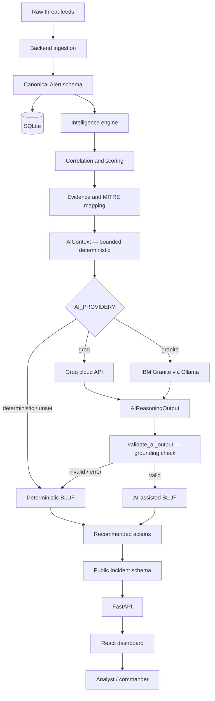

# Architecture

## System Overview

## Components

| Component | Technology | Responsibility |
|---|---|---|
| Frontend | React, Vite, TypeScript | Dashboard, alert explorer, incident investigation UI |
| Backend API | FastAPI | Frozen REST API, request validation, persistence orchestration |
| Intelligence engine | Python | Correlation, scoring, evidence, MITRE mapping, BLUF, actions |
| Groq provider | Groq cloud API | Optional AI-assisted BLUF via cloud LLM (llama-3.1-8b-instant) |
| Granite provider | IBM Granite via local Ollama | Optional AI-assisted BLUF via IBM open-source model running locally |
| Database | SQLite via SQLAlchemy | Alert and Incident persistence |
| Data | JSON, log, and text feeds | Synthetic multi-source threat inputs |

## Data Flow

1. Raw files under `src/data/raw/` are ingested by the backend.
2. Alerts are normalised into the canonical ten-field Alert schema.
3. Alerts are persisted in SQLite.
4. `POST /api/analyze` loads persisted Alerts and calls `analyze(alerts, provider)`.
5. The intelligence engine correlates, scores, extracts evidence, maps MITRE techniques.
6. A bounded, deterministic `AIContext` is built from the established intelligence results.
7. If `AI_PROVIDER=groq`, the `GroqProvider` sends the bounded context to the Groq API and requests an analyst-oriented BLUF explanation.
8. If `AI_PROVIDER=granite`, the `GraniteProvider` sends the bounded context to a local Ollama instance serving an IBM Granite model.
9. The `validate_ai_output()` grounding validator checks every reference and numeric claim. Any unsupported claim triggers the deterministic BLUF fallback.
10. The resulting `IntelligenceAnalysis` is converted to public Incident dictionaries.
11. Incidents are persisted and returned through the frozen API.
12. The React dashboard renders alerts, incidents, evidence, MITRE mappings, BLUF, and actions.

## API Boundary

The frozen API surface is:

- `GET /api/alerts`
- `GET /api/alerts/{id}`
- `GET /api/incidents`
- `GET /api/incidents/{id}`
- `GET /api/dashboard/stats`
- `POST /api/analyze`

## Intelligence Boundary

Member 1 owns all correlation, scoring, evidence, MITRE, BLUF, and action logic under `src/intelligence/`. The backend owns only:

- request validation,
- persistence,
- calling `intelligence.pipeline.analyze(alerts, provider)`,
- converting `IntelligenceAnalysis.to_public_incidents()` to JSON,
- exposing the frozen API,
- loading the configured AI provider via `intelligence.ai.factory.get_provider()`.

The backend does not reimplement intelligence logic.

## AI Boundary

The deterministic intelligence engine is authoritative for correlation, scoring, evidence extraction, MITRE mapping, and recommended actions. External AI providers are used exclusively for the optional analyst-oriented BLUF explanation.

### What is deterministic (unchanged by any AI provider)

- Alert normalization and validation
- Correlation and incident grouping
- Risk score, severity, and confidence
- Evidence extraction and IDs
- MITRE ATT&CK technique mapping
- Recommended actions

### What AI providers contribute

- Natural-language BLUF summary for commanders and analysts
- Technical reasoning narrative grounded in the established intelligence

### Provider selection

Controlled by the `AI_PROVIDER` environment variable (backend-only):

| Value | Provider | Requirements |
|---|---|---|
| `groq` | Groq cloud inference | `GROQ_API_KEY` |
| `granite` | IBM Granite via local Ollama | `GRANITE_ENABLED=true`, Ollama running with a Granite model |
| `deterministic` (default) | None — uses deterministic BLUF | None |

### Grounding protection

Before any AI output can influence a BLUF, `validate_ai_output()` checks every structured reference against the established `AIContext`:

- Alert IDs must exist in the correlated group.
- Evidence IDs must exist in the extracted evidence.
- MITRE technique IDs must exist in the controlled mapping.
- Hosts, users, and IP addresses must appear in the actual alerts.
- Numeric claims (risk score, alert count, etc.) must exactly match deterministic values.

Any invalid reference or mismatched numeric claim causes grounding to reject the output and fall back to the deterministic BLUF.

### Fallback behavior

If the selected AI provider is unavailable, raises an exception, returns unparseable output, or fails grounding validation, the deterministic BLUF is used. The application always works.

## IBM Technologies

### IBM Granite

IBM Granite is IBM's open-source foundation model family. The `GraniteProvider` runs a Granite model locally through Ollama. This does not require watsonx.ai or IBM cloud credentials. IBM Granite models are available at [https://ollama.com/library](https://ollama.com/library).

### IBM Bob

IBM Bob was used throughout the development lifecycle. See [`docs/ibm-bob-contribution.md`](ibm-bob-contribution.md).

## Persistence

SQLite is used through SQLAlchemy. The backend supports:

- idempotent schema creation,
- deterministic seeding,
- reset between demo runs,
- Docker volume persistence at `/data/elevatex.db`.

## Security Notes

- No secrets are committed; `.env` files are ignored by `.gitignore`.
- API inputs are validated with Pydantic.
- Database access uses SQLAlchemy ORM/Core with bound parameters.
- Alert text is treated as untrusted data, never as code or instructions.
- Intelligence evidence is grounded in supplied alerts and deterministic mappings.
- `GROQ_API_KEY` is read from environment variables only; never logged, returned in a response, or embedded in code.
- The Groq provider sends the API key only in the Authorization header over HTTPS.
- Alert text appears in AI prompts as quoted data, not as instructions.
- The frontend never receives or handles any AI provider credentials.
